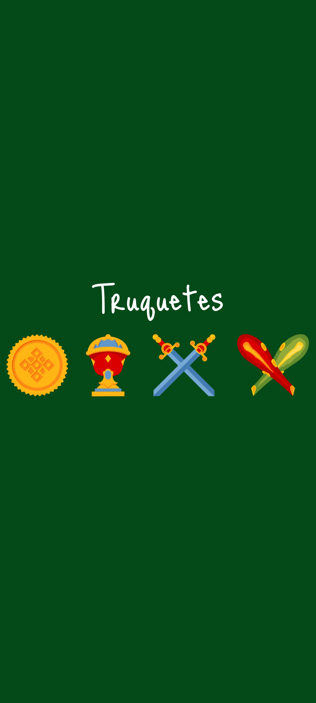
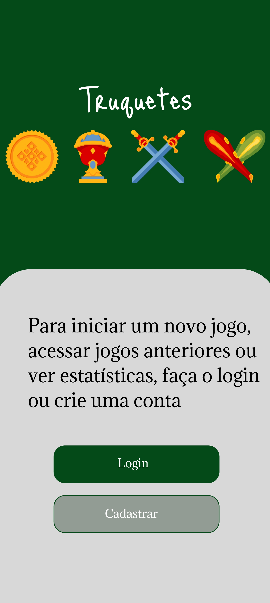
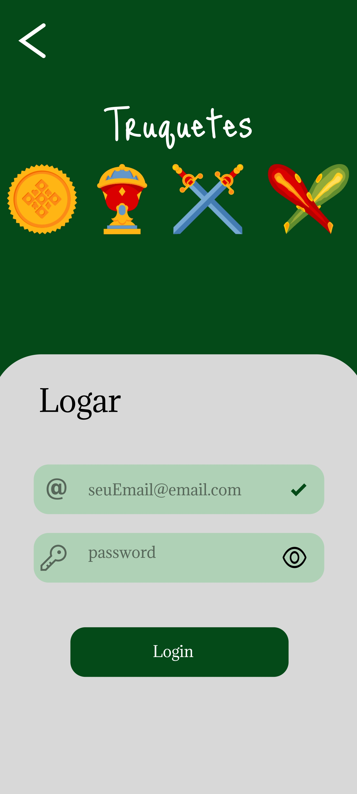
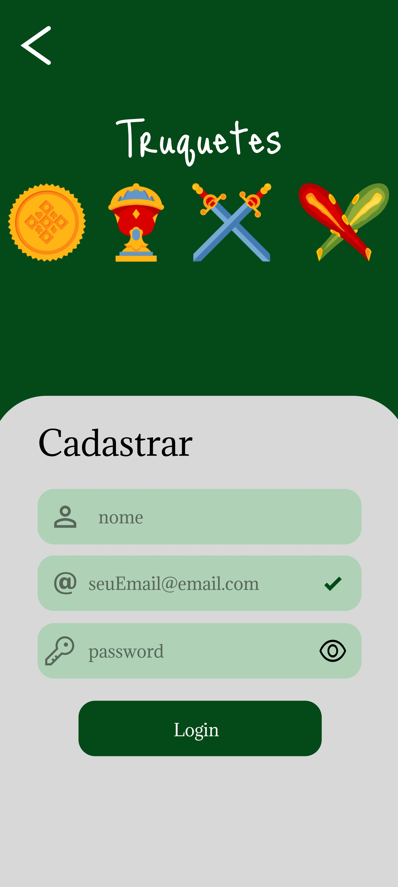
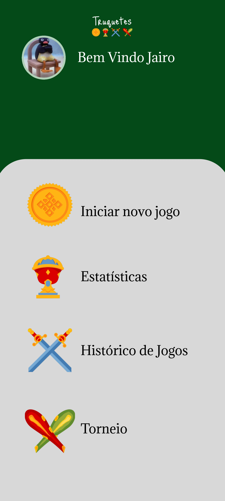
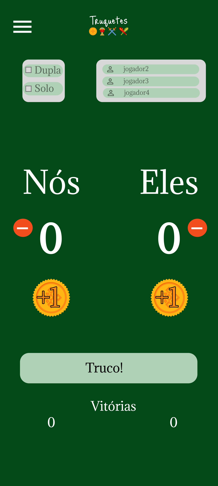
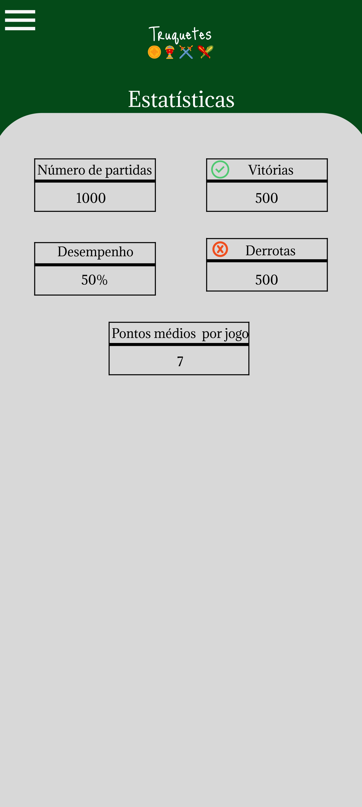
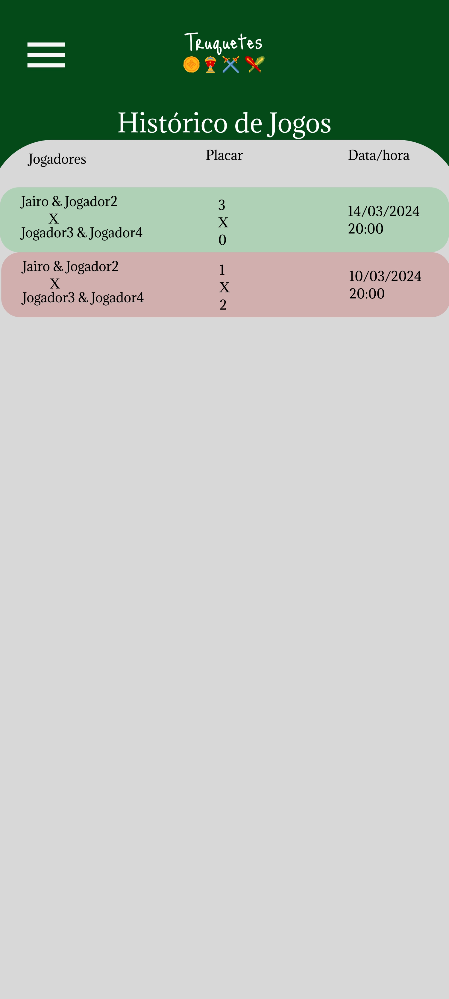
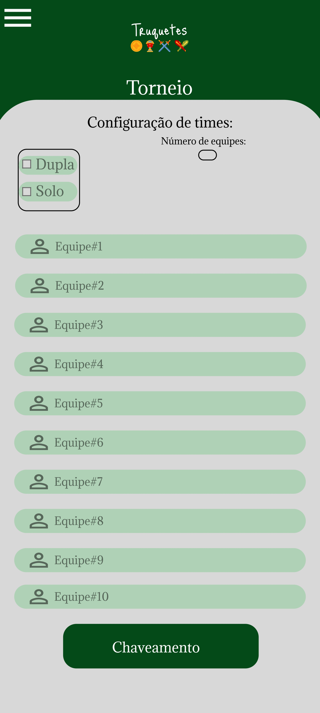
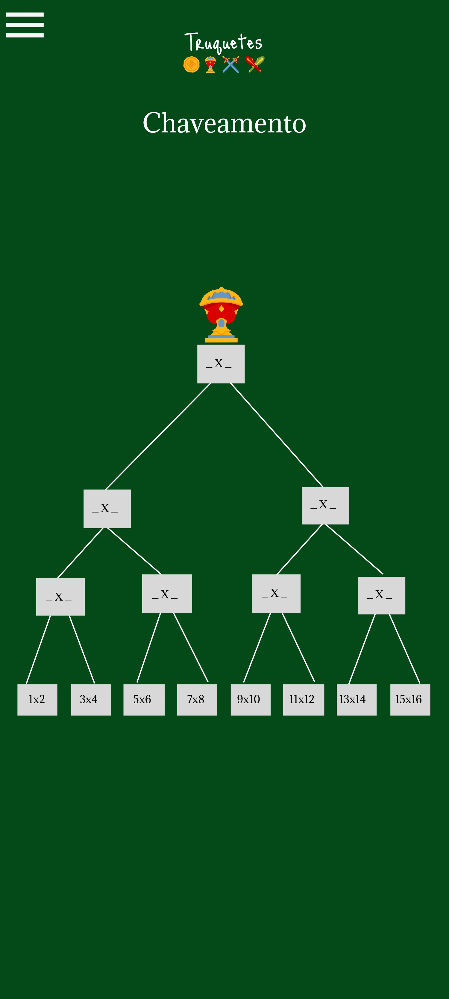

## Truquetes

Truquetes é um marcador de truco desenvolvido como parte de um projeto referente a disciplina de Programação para Dispositivos Móveis. Com uma interface simples e intuitiva, o Truquetes permite aos jogadores de truco manterem o controle das pontuações de suas partidas de forma fácil e eficiente.

### Principais funcionalidades:

- **Marcador de pontos:** Mantenha o controle dos pontos de cada equipe durante a partida de truco.
- **Histórico de partidas:** Visualize o histórico de partidas anteriores para acompanhar o progresso e desempenho ao longo do tempo.
- **Organizador de torneios:** Com o Truquetes, você pode organizar e gerenciar torneios de truco com facilidade. 
- **Sorteio e chaveamento:** O Truquetes oferece uma ferramenta integrada para realizar sorteios e criar o chaveamento dos torneios automaticamente.
- **Estatísticas das partidas:** Analise o desempenho dos jogadores e equipes com as estatísticas detalhadas das partidas. O Truquetes armazena a quantidade de partidas, vitórias, derrotas, desempenho e pontos médio por jogo.

# Protótipos

| Tela Loading                                      | Tela Login Escolha                                      | Tela Login Principal                                      |
| --------------------------------------------- | --------------------------------------------- | --------------------------------------------- |
|       |        |  |

| Tela Cadastro Usuário                                      | Tela Menu Principal                                       | Tela Marcador (Novo Jogo)                                      |
| --------------------------------------------- | --------------------------------------------- | --------------------------------------------- |
|       |        |  |

| Tela Estatísticas                                   | Tela Histórico de Jogos                                       | Tela Torneio                                      |
| --------------------------------------------- | --------------------------------------------- | --------------------------------------------- |
|       |        |  |

| Tela Chaveamento                               
| --------------------------------------------- | 
|       |